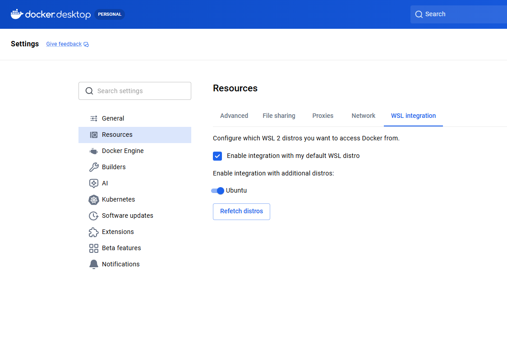

# Задание 4. Защита доступа к кластеру Kubernetes

---
В этом задании вы поработаете над решением технической задачи. Вам необходимо организовать ролевой доступ к Kubernetes для пользователей кластера.

### Вот контекст и факты о ролевой модели:
- Большинство бизнес-сервисов разворачивается в среде Kubernetes. Необходимо ограничить доступ к управлению кластером для различных групп пользователей.
- Необходимо защитить кластер с помощью предоставления привилегированных действий (например, просмотра секретов) для определённых групп пользователей.
- Кроме привилегированных групп пользователей, необходимо выделить ещё минимум две группы пользователей. У первой группы есть право только на просмотр ресурсов кластера. Вторая другая группа пользователей может настраивать кластер.
- Необходимо разграничить доступ к ресурсам кластера, исходя из организационной структуры компании.

### Что нужно сделать
- Поднимите пустой Minikube. В этот раз вы будете работать без тестового приложения. Изучать код не нужно, поэтому сфокусируйтесь на подготовке скриптов. Они должны будут отражать решения, которые получились у вас по итогу работы над первыми тремя заданиями. Для этого вам понадобится пустой Minikube.
- Определите все роли и их полномочия при работе с Kubernetes. Мы подготовили шаблон таблицы. Заполните её: укажите там роли, их полномочия и группы пользователей, которые им соответствуют.
- Подготовьте скрипты для создания пользователей. Рекомендуем создать не менее двух пользователей.
- Подготовьте скрипты, чтобы создать роли. Они должны соответствовать ролям из вашей таблицы.
- Подготовьте скрипты, чтобы связать пользователей с ролями.

- Когда вы выполните задание, у вас должно получиться три файла: по одному скрипту на третий, четвёртый и пятый пункты задания. Когда будете сдавать работу, загрузите заполненную таблицу и скрипты в директорию Task4 в рамках пул-реквеста.
---

## Инструкция по выполнению Задания 4 на Windows 10 с WSL

## Часть 1. Проверка и настройка WSL для работы с Minikube

### Шаг 1.1. Проверка версии WSL

```powershell
# В PowerShell (не в WSL)
wsl --version
```

**Если версия старая:** версия 1.2.5+ (WSL 2). 

```powershell
# Обновление WSL
wsl --update
wsl --set-default-version 2
```

### Шаг 1.2. Проверка установленного дистрибутива

```powershell
wsl --list --verbose
```

Должен быть дистрибутив со статусом `Running`. 
Если нет, запустите:
```powershell
wsl --distribution Ubuntu --user root
```

### Шаг 1.3. Вход в WSL

```powershell
# Просто введите
wsl -d Ubuntu
```

Приглашение должно быть вида: `user@hostname:~$`

## Часть 2. Установка Docker в WSL

### Шаг 2.1. Использование Docker Desktop 
- Запустить Docker Desktop
- Убедиться что интеграция включена (если интеграция была отключена может потребоваться остановка и запуск WSL)


### Шаг 2.1. Установка Docker (альтернативный способ)

```bash
# Внутри WSL
# Обновление пакетов
sudo apt update && sudo apt upgrade -y

# Установка зависимостей
sudo apt install -y ca-certificates curl gnupg lsb-release

# Добавление официального GPG-ключа Docker
sudo mkdir -p /etc/apt/keyrings
curl -fsSL https://download.docker.com/linux/ubuntu/gpg | sudo gpg --dearmor -o /etc/apt/keyrings/docker.gpg

# Добавление репозитория Docker
echo "deb [arch=$(dpkg --print-architecture) signed-by=/etc/apt/keyrings/docker.gpg] https://download.docker.com/linux/ubuntu $(lsb_release -cs) stable" | sudo tee /etc/apt/sources.list.d/docker.list > /dev/null

# Установка Docker
sudo apt update
sudo apt install -y docker-ce docker-ce-cli containerd.io docker-compose-plugin

# Добавление пользователя в группу docker (чтобы не использовать sudo)
sudo usermod -aG docker $USER

# Перезапуск WSL
exit

wsl -d Ubuntu
```

### Шаг 2.2. Проверка Docker

```bash
docker --version
docker ps
```

## Часть 3. Установка kubectl и Minikube в WSL

### Шаг 3.1. Установка kubectl

```bash
# Скачивание последней версии
curl -LO "https://dl.k8s.io/release/$(curl -L -s https://dl.k8s.io/release/stable.txt)/bin/linux/amd64/kubectl"

# Установка
chmod +x kubectl
sudo mv kubectl /usr/local/bin/

# Проверка
kubectl version --client
```

### Шаг 3.2. Установка Minikube

```bash
# Скачивание
curl -LO https://github.com/kubernetes/minikube/releases/latest/download/minikube-linux-amd64

# Установка
chmod +x minikube-linux-amd64
sudo mv minikube-linux-amd64 /usr/local/bin/minikube

# Проверка
minikube version
```
###### Если возникли ошибки при проверке
[см. тут](%D0%95%D1%81%D0%BB%D0%B8%20%D0%B2%D0%BE%D0%B7%D0%BD%D0%B8%D0%BA%D0%BB%D0%B8%20%D0%BE%D1%88%D0%B8%D0%B1%D0%BA%D0%B8%20%D0%BF%D1%80%D0%B8%20%D0%BF%D1%80%D0%BE%D0%B2%D0%B5%D1%80%D0%BA%D0%B5.md)

### Шаг 3.3. Установка OpenSSL

```bash
sudo apt install -y openssl
openssl version
```

## Часть 4. Запуск Minikube

```bash
# Запуск Minikube с драйвером docker
minikube start --driver=docker --cpus=2 --memory=4096
```

```bash
# Проверка статуса
minikube status
```
**Ожидаемый вывод:**
```
minikube
type: Control Plane
host: Running
kubelet: Running
apiserver: Running
kubeconfig: Configured
```

```bash
# Проверка доступа к кластеру
kubectl get nodes
```
**Ожидаемый вывод:**
```
NAME       STATUS   ROLES           AGE   VERSION
minikube   Ready    control-plane   30s   v1.30.0
```

## Часть 5. Создание скриптов для задания

### Создание директории и переход в неё

```bash
cd /mnt/e/YaPracticumArc/architecture-pro-propdevelopment/Task4
# Или создайте новую директорию
mkdir -p ~/k8s-rbac-task4
cd ~/k8s-rbac-task4
```

### Скрипт 1: `create-users.sh`

```bash

```

### Скрипт 2: `create-roles.sh`

```bash

```

### Скрипт 3: `bind-roles.sh`

```bash

```

## Часть 6. Таблица ролей и полномочий

| Роль                     | Права роли                                                                                               | Группы пользователей |
|--------------------------|----------------------------------------------------------------------------------------------------------|----------------------|
| **viewer**               | `get`, `list`, `watch` на подах, сервисах, деплойментах, конфигмапах                                     | Аудиторы             |
| **security-auditor**     | `get`, `list`, `watch` на секретах, ролях, rolebinding-ах                                                | Аудиторы, СБ         |
| **developer**            | `create`, `delete`, `update`, `patch`, `get`, `list`, `watch` на подах и деплойментах в неймспейсе `dev` | Разработчики         |
| **devops-engineer**      | Полный доступ ко всем ресурсам в неймспейсах `dev` и `staging`                                           | DevOps               |
| **devops-engineer-prod** | Чтение и ограниченное изменение ресурсов в `production`                                                  | DevOps               |
| **cluster-reader**       | `get`, `list` на узлах, неймспейсах, PV                                                                  | DevOps               |
| **cluster-admin**        | Полный доступ ко всем ресурсам кластера                                                                  | Администраторы       |

## Часть 7. Запуск всех скриптов

```bash
# Перейдите в директорию со скриптами
cd ~/k8s-rbac-task4
# или 
cd /mnt/e/YaPracticumArc/architecture-pro-propdevelopment/Task4

# Дайте права на выполнение
chmod +x create-users.sh create-roles.sh bind-roles.sh

# Запустите по порядку
./create-users.sh
./create-roles.sh
./bind-roles.sh

# Проверка результата
kubectl get clusterroles | grep -E "viewer|security-auditor|cluster-reader"
kubectl get roles --all-namespaces | grep -E "developer|devops"
kubectl get clusterrolebindings | grep -E "auditor|devops|admin"
```

## Часть 8. Проверка разграничения доступа

```bash
# Проверка пользователя auditor-ivanov
kubectl --kubeconfig=./kubeconfigs/auditor-ivanov.kubeconfig get pods --all-namespaces
kubectl --kubeconfig=./kubeconfigs/auditor-ivanov.kubeconfig get secrets --all-namespaces
kubectl --kubeconfig=./kubeconfigs/auditor-ivanov.kubeconfig delete pod test -n dev  # Должна быть ошибка

# Проверка пользователя developer-smirnov
kubectl --kubeconfig=./kubeconfigs/developer-smirnov.kubeconfig get pods -n dev
kubectl --kubeconfig=./kubeconfigs/developer-smirnov.kubeconfig get pods -n production  # Должна быть ошибка

# Проверка пользователя devops-volkov
kubectl --kubeconfig=./kubeconfigs/devops-volkov.kubeconfig run nginx -n dev --image=nginx
kubectl --kubeconfig=./kubeconfigs/devops-volkov.kubeconfig delete pod nginx -n dev

# Проверка пользователя admin-sokolov
kubectl --kubeconfig=./kubeconfigs/admin-sokolov.kubeconfig get nodes
```

## Устранение возможных проблем

[Если возникли ошибки при проверке - Часть 8. Проверка разграничения доступа](%D0%95%D1%81%D0%BB%D0%B8%20%D0%B2%D0%BE%D0%B7%D0%BD%D0%B8%D0%BA%D0%BB%D0%B8%20%D0%BE%D1%88%D0%B8%D0%B1%D0%BA%D0%B8%20%D0%BF%D1%80%D0%B8%20%D0%BF%D1%80%D0%BE%D0%B2%D0%B5%D1%80%D0%BA%D0%B5.md)
